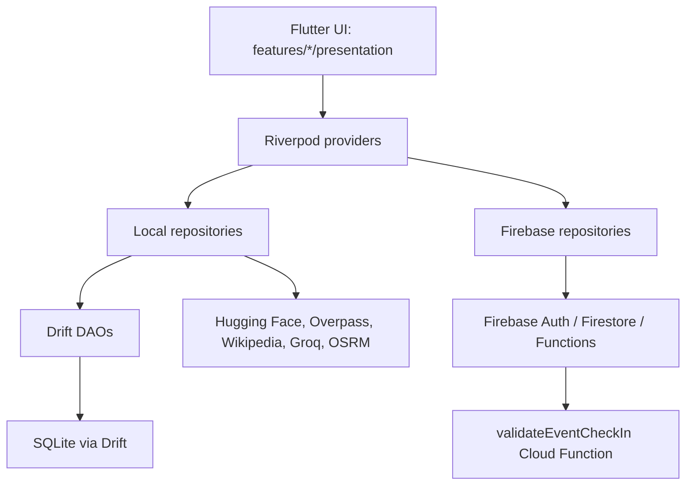

# Architecture

## Current architecture

The project is a feature-oriented Flutter app using Riverpod for dependency injection/state, repositories for data orchestration, Drift DAOs for local data, and Firebase repositories for cloud Campaign/Event workflows.

## Startup flow

1. `main.dart` calls `WidgetsFlutterBinding.ensureInitialized()`.
2. `bootstrapFirebase()` attempts `Firebase.initializeApp()`.
3. If Firebase config is missing, bootstrap returns `notConfigured`; the app continues.
4. Desktop window options are initialized.
5. `SharedPreferences` is loaded.
6. `ProviderScope` overrides SharedPreferences and Firebase bootstrap status.
7. GoRouter starts at `/seed`.
8. After seed completion, `SeedingScreen` navigates to `/auth`.
9. `/auth` sends configured/signed-in users to `/map`; otherwise it sends users to `/login`.

## Navigation

| Route | Screen | Notes |
| --- | --- | --- |
| `/seed` | `SeedingScreen` | Startup seed flow. |
| `/auth` | `AuthGateScreen` | Firebase-aware auth gate; does not crash if Firebase is missing. |
| `/login` | `LoginScreen` | Google sign-in/logout and Firebase not-configured messaging. |
| `/map` | `AppShell` | Main shell with Map, Explorer, Schools, AI, Campaigns tabs. |
| `/explorer` | `AppShell` | Compatibility route for existing Explorer navigation. |

## Local ChronoGIS data flow

UI -> Riverpod -> local repositories -> API/DAO -> SQLite -> UI.

Local repositories remain responsible for:

- Administrative data seed.
- GeoJSON boundary cache.
- Tourism POI seed/enrichment.
- OSM school POI seed.
- Local chat history.
- OSRM route calls.

The local SQLite `schools` table is still only an OpenStreetMap POI cache. It is not used for Campaign/Event organizer schools.

## Firebase Campaign/Event data flow

UI -> Riverpod -> Firebase repositories -> Auth/Firestore/Functions.

Implemented Firebase modules:

| Module | Purpose |
| --- | --- |
| `core/firebase/firebase_bootstrap.dart` | Optional Firebase initialization and App Check activation attempt. |
| `core/firebase/firebase_providers.dart` | Nullable Firebase Auth/Firestore/Functions providers. |
| `core/firebase/firestore_paths.dart` | Centralized Firestore collection paths. |
| `features/auth` | Google sign-in, logout, auth gate, and user profile creation. |
| `features/managed_schools` | Firestore `managed_schools` model/repository. |
| `features/campaigns` | Campaign model, repository, and UI. |
| `features/campaign_events` | Campaign event model and repository. |
| `features/participants` | Participant model, roles, approval/rejection. |
| `features/check_in` | Client location permission, check-in callable, and local validators. |

## Check-in authority

Client code does not directly write check-in documents.

1. User taps check-in in the Campaigns tab.
2. Client obtains current device location using `geolocator`.
3. Client calls Cloud Function `validateEventCheckIn`.
4. Function verifies auth, campaign status, event status, participant approval/role, check-in time window, managed school status/location, radius, location accuracy, and duplicate check-in.
5. Function writes `campaigns/{campaignId}/events/{eventId}/checkins/{uid}` inside a transaction.
6. Firestore rules deny direct client create/update/delete on `checkins`.

## State management

Riverpod remains the app-wide DI and state layer.

- Firebase service providers return nullable instances when Firebase is not configured.
- Repositories throw `FirebaseNotConfiguredException` only inside Firebase-specific flows.
- UI screens show not-configured states rather than crashing the app.

## MVVM fit

The Firebase work follows a repository/provider split, but the existing app is not strict MVVM.

Known architecture debt remains:

- `MapViewScreen` is still large and mixes UI with provider/calculation logic.
- Some filtering remains inside UI/provider files.
- The app does not have a dedicated use-case layer.

This task intentionally avoided a broad navigation or MapViewScreen rewrite.
