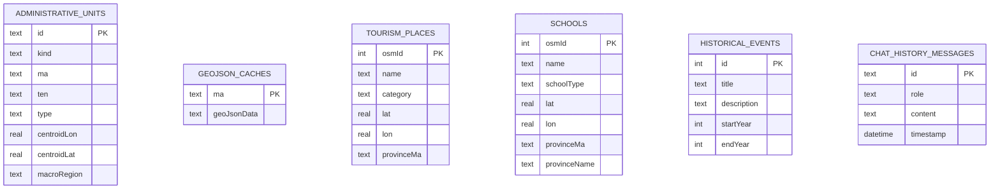
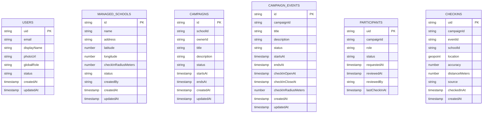

# Database Schema

## Local SQLite schema

The ChronoGIS data store is local SQLite through Drift. Schema version remains `3`; this task did not change Drift schema or migrations.

Implemented local tables:

- `administrative_units`
- `geojson_caches`
- `tourism_places`
- `schools`
- `historical_events`
- `chat_history_messages`

The local `schools` table is an OpenStreetMap school POI cache. It has no owner, campaign relation, authorization fields, or check-in radius. Do not treat it as a Campaign/Event managed school table.

## Firestore schema

Firebase Campaign/Event data is stored in Firestore. Collection names are centralized in `lib/core/firebase/firestore_paths.dart`.

## Firestore paths

| Path | Purpose | Client writes |
| --- | --- | --- |
| `users/{uid}` | Auth profile and global role/status. | Self create/update limited profile fields; role/status not self-editable. |
| `managed_schools/{schoolId}` | Organizer school records with GPS radius. | Admin only by rules. |
| `campaigns/{campaignId}` | Campaign metadata. | Signed-in creator can create draft; managers can update. |
| `campaigns/{campaignId}/events/{eventId}` | Campaign event metadata and check-in window. | Campaign managers only. |
| `campaigns/{campaignId}/participants/{uid}` | Membership, campaign role, approval status. | User can create own pending request; managers review. |
| `campaigns/{campaignId}/events/{eventId}/checkins/{uid}` | Server-validated check-in record. | Direct client writes denied; Cloud Function writes. |

## Cloud Function validation

`functions/src/index.ts` exports callable `validateEventCheckIn`.

Validation performed:

- Firebase Auth user is present.
- Payload campaign/event/location fields are valid.
- Location accuracy is acceptable when provided.
- Campaign and event exist and are `published` or `ongoing`.
- Participant exists, is `approved`, and has an allowed campaign role.
- Current server time is inside the event check-in window.
- Managed school exists and is active.
- User location is within event or school radius.
- Duplicate check-in document does not already exist.

## Security rules status

`firestore.rules` denies direct client writes to check-ins and models basic user/admin/campaign manager authorization. The rules file has not yet been emulator-tested because Firebase CLI could not be fetched in this environment.

## Indexes

`firestore.indexes.json` currently contains no custom composite indexes. Add indexes when Firestore query errors identify required composites from real usage.
